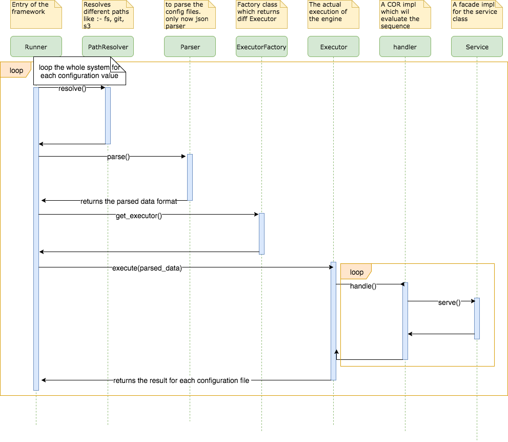
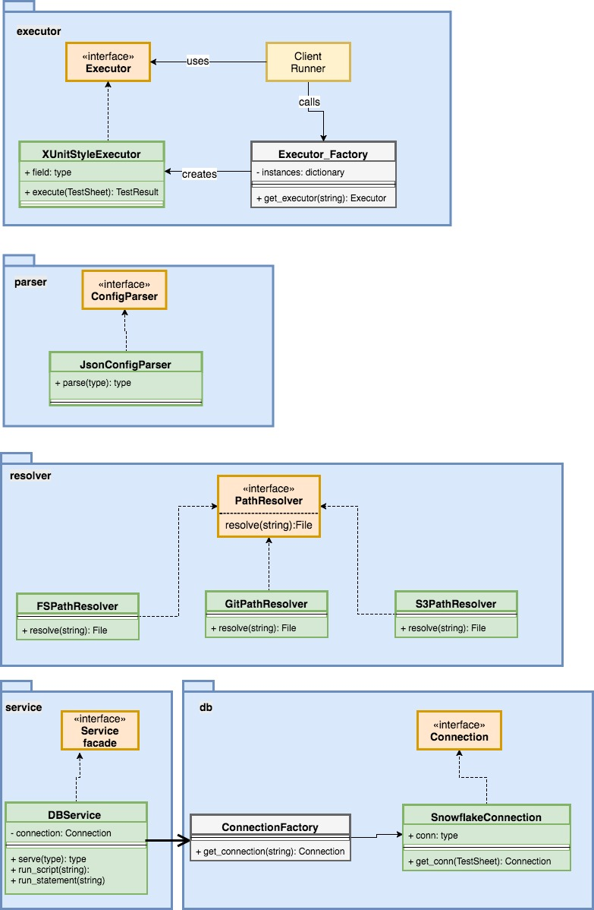

Contents
=========
 * [Features](#features)
 * [Usage](#usage)
   * [Prerequisite](#prerequisite)
   * [Run](#run)
   * [Parameters](#parameters)
 * [Architecture](#architecture)
   * [Flow](#flow)
   * [Conventions](#conventions)
   * [Diagrams](#diagrams)
 * [Support](#support)
 
   
 
 
 
Features
--------
 
- Provides unit test and regression test solutions.
- Can take input data from sql statements, sql scripts or even from the local file system using snowsql cli.
- Provides a cumulative test reports of total number test cases and success.
- Accepts different types of test configuration files like - json, yaml etc.
- Supports variety of resources like - filesystem, git and s3.
- Can be extended in future. 

Usage
-----

We will see how to use the framework in action. But before that there are some prerequisities.

### Prerequisite
 - Make sure the snowsql CLI program is installed. (this is needed to ingest data from local system into the snowflake warehouse).
 - python 3.6+ is recommended.
 - the dependencies needs to be installed . (PyYAML, boto3, pycryptodome, snowflake-connector-python)
   to install a dependency you can use >pip install module_name

### Run
python runner.py execute-one fs xunit /Users/deepak/PycharmProjects/rfk-sql-test-framework/test/files/running_config_be_step1_inventory_shoulbe.json

### Parameters

|  attribute|type  |required |                description 					                                      |              example |
|-----------|------|---------|-----------------------------------------------------------------------|----------------------|
| name 		|string  |mandatory | name of the configuration | test_inventory_step1 |
|author |string|optional | author of the config | ABC |
|date | string | optional | date | 20180723 |
|sql_path |string | mandatory | path where all the test files, scripts will be searched when executing the conf file | /user/abc/tests |
|script_path | string | mandatory | actual sql script to run | ../be/workflow_step1_inventory_triggers_hourly.sql
| before_once | array| mandatory| it can be a an array of sql statements or keys or scripts, executed only once for the entire configuration file| ["INSERT INTO TABLE1..","$INSERT2"]
| before_each| do | do | same as before_once, only things is it is executed for each test case | do|
| before_test | do | do | executed before each test. put all the test case specific queries here | do |
|asserts | array of objects | mandatory | | |
|sql | string | mandatory | can be a sql statement. query to compute the actual and expected query diff | |
|expected | array | mandatory | array of sql statements to load the data into the expected tables | |

Architecture
------------

### Flow
 1. The "Runner" acts as  the bootstrap of the framework. It scans the command line arguments like - python runner.py execute-one fs xunit /Users/deepak/PycharmProjects/rfk-sql-test-framework/test/files/running_config_be_step1_inventory_shoulbe.json
 2. The first step is from the it resolves where to check the configuration file
 3. Then once the path is resolved then based on the file extension the engine calls the "ParserFactory" and creates a Parser.
 	so, if the configuration file is test_x.json then the engine will call the Parserfactory and creates JsonParser object.
 	if the configuration file name is test_*.yaml then the engine will call the YamlParser and parse.
 4.After the configuration object 
 
### Conventions

The framework is based on a number of conventions.
- All the executable blocks like - before_once, before_each, before_test, expected, after_test, after_each, after_once will be executed as provided in the arguments. So, the convention here is:-
when the block contains:-
    - some_script.sql  - the framework treats this as a SQL script and executes it as a SQL script. The framework searches the script file inside the sql_script location. If you want a different path then you can mention the absolute path.
  eg:- 'some_script.sql'  -- will be searched inside the sql_script location.
       '/user/user_name/tests/some_script.sql' -- the sql script file will be used in the specified location
    - $some_string - if there is a leading single dollar sign is appended , then the engine will try to search a key named "some_string" in the default ini file present in the sql_path directory. default ini file name is same name as the configuration file name with .ini extension.
  eg:- If before_once = "$insert_step1_inventory_trigger" and  
	 	      configuration file name  = "test_step1_inventory_trigger.json" and
	 	      sql_path= "/users/user_name/projects/tests"
	 then the framework will search for a file named "/users/user_name/projects/tests/test_step1_inventory_trigger.ini" and find a key named insert_step1_inventory_trigger inside the ini file.
 (This can be handy when you want to execute so many sql statements for your configuration and don't want to convoluate with many .sql script files. Then you can put all your SQL statements inside the .ini file and then the framework will take care of the rest)
  
  Sample .ini file:-
  [SQL]
  insert1 = INSERT INTO TABLE1 SELECT 'ckey1','uuid1'.
    - some_statement - simplest one out of the three. Used mainly for evaluating small sql statements. eg:- "SET DATE='20180702'" or "USE DB_NAME" etc.
    - snowsql>statment - This is the most important one in the sense when you have more complex data structures in your table, and you don't want to respresent them using any sql insert. You can directly use this functionality to bulk load data into your snowflake warehouse.

 (Note:- It's very important to note that to use this functionality you need to have the snowsql CLI client needs to be installed in your system)

- If there is any / character in your data, then the framework takes it as a path and then try to search the file inside your path.So, '/user/user_name/projects/tests/INSERT INTO TABLE1 VALUES ()' will give you error. because the engine will try to look for a file
inside the file system.

- All executables are done via the framework engine itself eg:- SQL query execution. unless otherwise specified with a compoenent name with the below format component_name:statement.

### Diagrams

 
 Support
 -------
 - For enhancements/issues please raise a jira ticket.
 - For support email us at - dataplatform@reflektion.com or slack us

